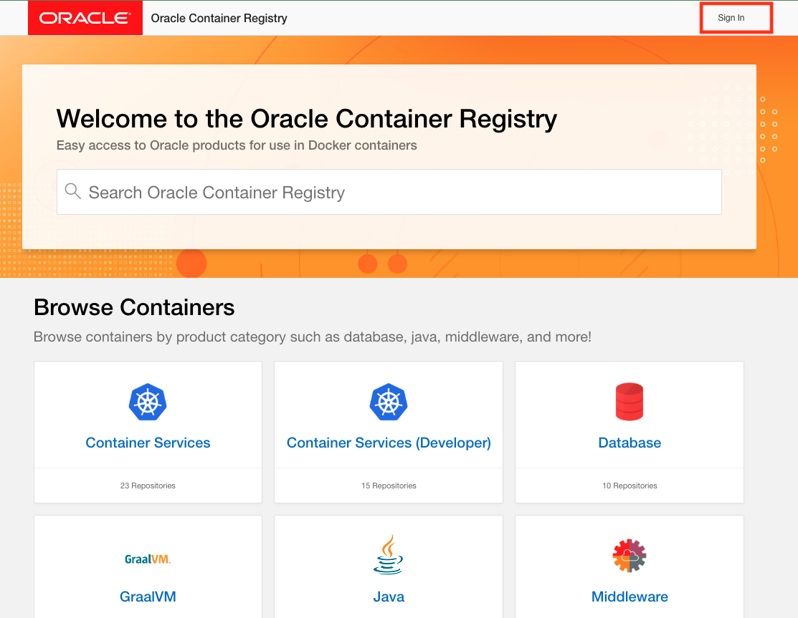
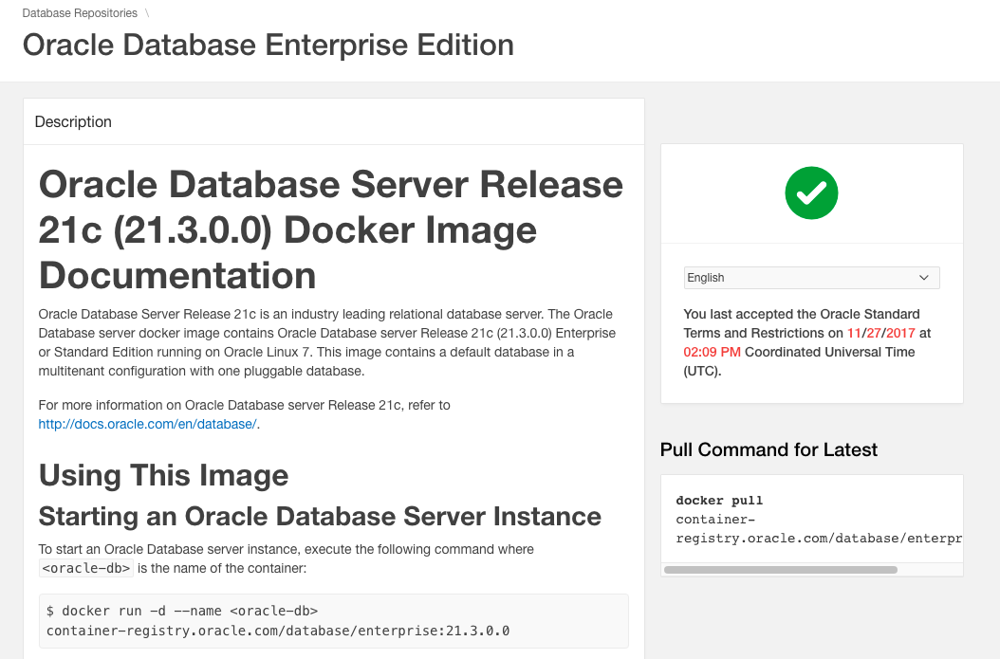

# Install and configure the operator

## Introduction

An operator is an application-specific controller that extends Kubernetes to create, configure, and manage instances of complex applications. The Oracle Database Kubernetes Operator (the "operator") manages the management and operation of the database deployments on the kubernetes cluster.

This lab walks you through the steps to install theDatabase Operator using the CLoud Shell.

Estimated Lab Time: 15 minutes

## Task 1: Prepare to pull the DB Docker image
To access the pre-configured docker image containing the Oracle 21c Enterprise Edition database from the Oracle Container Registry, you need to sign in and accept the required developer License Agreement.

1. Navigate to the [Oracle Container Registry](https://container-registry.oracle.com/) and log in with your Oracle account. 
   > **Attention**: This is **not** your Cloud account but the account you used to register to the Oracle website, sign up for events or download software.
   
   

2. Sign in with your Oracle account

3. Navigate to the Database section

4. Click on the `Continue` button besides the **Enterprise** edition, scroll down to the bottom of the page and `Accept` theT&C's.

   You should now see a green checkmark besides the Enterprise edition version
   

5. Now click on the blue **enterprise** label to see the download instructions, especially the exact path for the pull command
   


## Task 2: Install the operator using the Cloud Shell

The operator uses webhooks for validating user input before persisting it in Etcd. Webhooks require TLS certificates that are generated and managed by a certificate manager.

1. Install the certificate manager with the following command:

```
<copy>kubectl apply -f https://github.com/jetstack/cert-manager/releases/latest/download/cert-manager.yaml</copy>
```

The resulting output should have no error messages and end like below:

```shell
clusterrolebinding.rbac.authorization.k8s.io/cert-manager-webhook:subjectaccessreviews created
role.rbac.authorization.k8s.io/cert-manager-cainjector:leaderelection created
role.rbac.authorization.k8s.io/cert-manager:leaderelection created
role.rbac.authorization.k8s.io/cert-manager-webhook:dynamic-serving created
rolebinding.rbac.authorization.k8s.io/cert-manager-cainjector:leaderelection created
rolebinding.rbac.authorization.k8s.io/cert-manager:leaderelection created
rolebinding.rbac.authorization.k8s.io/cert-manager-webhook:dynamic-serving created
service/cert-manager created
service/cert-manager-webhook created
deployment.apps/cert-manager-cainjector created
deployment.apps/cert-manager created
deployment.apps/cert-manager-webhook created
mutatingwebhookconfiguration.admissionregistration.k8s.io/cert-manager-webhook created
validatingwebhookconfiguration.admissionregistration.k8s.io/cert-manager-webhook created
```


2. Next we'll install the operator itself using the default [oracle-database-operator.yaml](https://github.com/oracle/oracle-database-operator/blob/main/oracle-database-operator.yaml) file straight from the git repo.  Of course you can also download and edit this file manually, as there are various options that can be controlled in this fashion.

```
<copy>kubectl apply -f https://raw.githubusercontent.com/oracle/oracle-database-operator/main/oracle-database-operator.yaml</copy>
```

Again you should see an output ending like below, without errors :

```shell
clusterrolebinding.rbac.authorization.k8s.io/oracle-database-operator-oracle-database-operator-proxy-rolebinding created
service/oracle-database-operator-controller-manager-metrics-service created
service/oracle-database-operator-webhook-service created
certificate.cert-manager.io/oracle-database-operator-serving-cert created
issuer.cert-manager.io/oracle-database-operator-selfsigned-issuer created
mutatingwebhookconfiguration.admissionregistration.k8s.io/oracle-database-operator-mutating-webhook-configuration created
validatingwebhookconfiguration.admissionregistration.k8s.io/oracle-database-operator-validating-webhook-configuration created
deployment.apps/oracle-database-operator-controller-manager created
```


3. Now validate that the operator is indeed running on the three nodes of the kubernetes cluster with the below command : 

   ```
   <copy>kubectl get pod -n oracle-database-operator-system -o wide</copy>
   ```

   The output should be something like the below, where you can see each pod runs on a different node of the cluster:

   ```shell
   NAME                                                           READY   STATUS    RESTARTS   AGE     IP             NODE          NOMINATED NODE   READINESS GATES
   oracle-database-operator-controller-manager-5fbbffb45c-9v7k8   1/1     Running   0          6m25s   10.244.0.5     10.0.10.52    <none>           <none>
   oracle-database-operator-controller-manager-5fbbffb45c-mdxvj   1/1     Running   0          6m25s   10.244.1.132   10.0.10.193   <none>           <none>
   oracle-database-operator-controller-manager-5fbbffb45c-slj5l   1/1     Running   0          6m25s   10.244.0.132   10.0.10.149   <none>           <none>
   ```

   

The Database Kubernetes Operator has been installed. You may now **proceed to the next lab**.


## Acknowledgements
* **Author** - Jan Leemans, July 2022
* **Last Updated By/Date**
